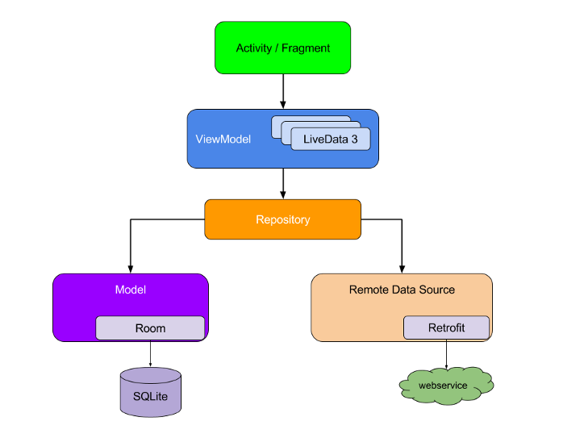
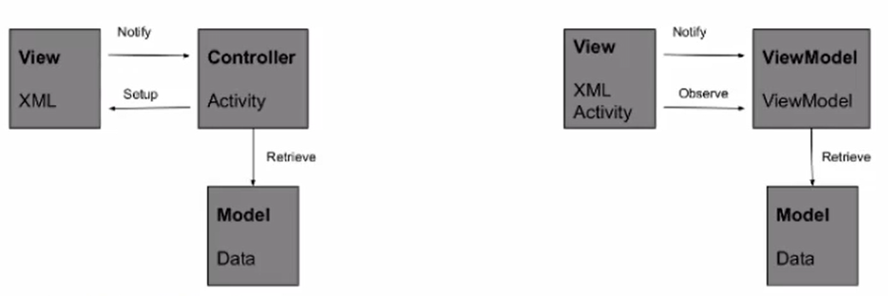

# Index

- [Database](#Database)
- [UI Components](#UI-Components)
- [Info](#Info)

## Database

- [MVVM Design Pattern](#MVVM-Design-Pattern)
- [ViewModel](#ViewModel)
- [Observables](#Observables)
- [Lifecycle awareness](#Lifecycle-awareness)
- [LiveData](#LiveData)
- [MVC vs MVVM](#MVC-vs-MVVM)
- [Room](#Room)

#### MVVM Design Pattern



- **Activity/fragment**: parte visuale
- **ViewModel**: struttura che mantiene i dati che vengono visualizati (es: tutte le stringhe che vengono visualizzate in una view)
- **Model**: classe con il compito di reperire i dati memorizzati in locale (chiesti dal ViewModel)
- **Remote Data Source**: classe con il compito di reperire i dati memorizzati in remoto (chiesti dal ViewModel)
- **Repository**: implementa il SSOT. Intermediario che lavora per il ViewModel, riceve le sue richieste e decide da dove andare a recuperare i dati per esaudirla (es: prende i dati dal webService, li salva su SQLite e restituisce i dati presenti in SQLite)

#### ViewModel

- **Cosa è un ViewModel?**: classe con vita propria
- **Accoppiata a cosa?**: accoppiata ad un oggetto visuale (view, fragment, activity) dotato di un lifecycle o anche all'applicazione in generale
- **Cosa fa?**: gestisce tutte le interazioni con i dati e mantiene anche in memoria i dati che poi verranno visualizati nell'interfaccia (in questo modo nell'activity nessun dato sarà inserto hardcoded, ma tutti i dati verranno presi da variabili presenti nel ViewModel)
- **Sopravvive ai cambi di figurazione?**: si
- **Scope?**: lo stesso del lifecyle dell'oggetto a cui viene accoppiato durante la creazione del ViewModelProvider (da onCreate a onDestroy)
- **Scope aplicazione?**: si può, serve per portarsi dietro il riferimento all'applicazione che verrà poi usato per creare il database
- **Quanti ViewModel può avere un oggetto?**: 1
- **Quanti fragment possono avere lo stesso ViewModel?**: piu di uno (passando _requireActivity()_ al ViewModelProvider)
- **Come si crea un ViewModel?**

```java
public class MyViewModel extends ViewModel{
  private List<User> users;
  public List<User> getUsers() {
    // repostiory.getUsers()    -    Do an asynchronous operation to fetch users.
    return users;
  }
}
```

- **Come si recupera la variabile del ViewModel all'interno di una activity?**

```java
private MyViewModel viewModel = new ViewModelProvider(this).get(MyViewModel.class);
private List<User> users = viewModel.getUsers();
```

```java
private MyAndroidViewModel viewModel = ViewModelProvider.AndroidViewModelFactory.getInstance(this.getApplication()).create(MyAndroidViewModel.class)
private List<User> users = viewModel.getUsers();
```

#### Observables

- **Cosa è un Observables?**: è un tipo di dato che ha come parametro un altro tipo (es stinga, integere ...)
- **Come si usa?**: si dice ad una seconda classe di osservare questo Observables, tutte le volte che esso viene modificato allora la classe che lo osserva viene notificata
- **Come è possibile?**: l'Observables si tiene una lista interna di riferimenti di oggtti che la osservano, quindi tutte le volte che essa cambia si va a leggere la lista degli oggetti che la osservano e li notifica
- **Perchè importante?**: non serve un doppio riferimento, l'Observables non deve mai chiamare indietro la classe in cui è contenuta perche avviene tutto sotto
- **Come si crea un Observables?**

```java
public final ObservableInt age = new ObservableInt();
```

```java
public final ObservableField<String> name = new ObservableField<>();
```

```java
public final ObservableArrayList<String> users = new ObservableArrayList<>();
```

#### Lifecycle awareness

- **Cosa è la Lifecycle awarenes?**: è il fatto di osservare un certo oggetto dotato di un lifecycle e di reagire a determinati suoi cambi di stato
- **Vantaggio?**: se si ha uno stesso oggetto che fa cose diverse in base allo stato, allora il suo codice viene spezzettato nelle varie funzioni (es: onCreate, onResume ...). Per evitare questo spezzettamento, si crea una classe che implementa _LifecycleObserver_ che gli permette di reagire ai cambi di stato di un oggetto
- **Come si crea una classe che implementa LifecycleObserver?**

```java
public class MyObserver implements LifecycleObserver {
    @OnLifecycleEvent(Lifecycle.Event.ON_RESUME)
    public void function1() {
        // ...
    }
    @OnLifecycleEvent(Lifecycle.Event.ON_PAUSE)
    public void function2() {
        // ...
    }
}
```

- **Come si aggiunge un LifecycleObserver al lifecycle di un oggetto?**

```java
myLifecycleOwner.getLifecycle().addObserver(new MyObserver());
```

#### LiveData

- **Cosa sono i LiveData?**: sono dei Observables con la lifecycle awareness
- **Cosa fanno?**: notificano l'osservatore solo quando esso si trova in uno stato attivo (almeno started)
- **vantaggio?**: dato dal fatto che gli osservatori (activity, fragment, ...) non hanno bisogno di condizioni sul loro stato per essere notificati
- **Dove stannp?**: nel ViewModel
- **Diferenza tra LiveData e MutableLiveData?**: il MutableLiveData può cambiare il suo valore attivamente, il LiveData no
- **Come si crea un LiveData?**

```java
public class NameViewModel extends ViewModel {

  private LiveData<String> currentName;

  // The observer (activity) cannot modify currentName
  public LiveData<String> getCurrentName() {
    if (currentName == null) currentName = new LiveData<String>();
    return currentName;
  }
}
```

- **Come si crea un MutableLiveData?**

```java
public class NameViewModel extends ViewModel {

  private MutableLiveData<String> currentName;

  // The observer (activity) can modify currentName
  public MutableLiveData<String> getCurrentName() {
    if (currentName == null) currentName = new MutableLiveData<String>();
    return currentName;
  }
}
```

- **Come osservare un LiveData?**

```java
public class NameActivity extends AppCompatActivity {

  private NameViewModel model;

  @Override
  protected void onCreate(Bundle savedInstanceState) {
      super.onCreate(savedInstanceState);

      // Other code to setup the activity...

      // Get the ViewModel.
      model = new ViewModelProvider(this).get(NameViewModel.class);

      // Create the observer which updates the UI.
      final Observer<String> nameObserver = new Observer<String>() {
          @Override
          public void onChanged(@Nullable final String newName) {
              // Update the UI, in this case, a TextView.
              nameTextView.setText(newName);
          }
      };

      // Observe the LiveData (currentName), passing in this activity as the LifecycleOwner and the observer.
      model.getCurrentName().observe(this, nameObserver);
  }
}
```

- **Come si modifica un MutableLiveData?**

```java
model.getCurrentName().setValue(anotherName); // main thread
```

```java
model.getCurrentName().postValue(anotherName); // worker thread
```

#### MVC vs MVVM



- Separazione concetti: **MVC**

  - Il Controller è la parte attiva (siccome referenzia sia la View che il Model)
  - View e Model per essere testati necessitano per forza del COntroller
  - Cambiando la View bisogna anche cambiare il Controller

- Separazione concetti **MVVM**

  - La View è la parte attiva (l'activity si sposta dal Controller/ViewModel alla View)
  - L'activity perde molte respinsabiltà che vanno date al ViewModel
  - ViewModel e Model possono essere testati singolarmente siccome non hanno riferimenti all'indietro
  - Si può cambiare la view mantenendo lo stesso ViewModel (usare una nuova viewche usa la stessa logica di quella precedente)

#### Room


- **Entities**: classi del modello (campi + setter & getter). Matching 1 a 1 con le tabelle del db

  ```java
  // EXAMPLE

  @Entity
  public class Entity1 {
    @PrimaryKey
    private final long id;
    private final String firstField;
    private final String secondField;
    @Ignore               // presente nella classe entity ma non nel database
    private final String tmp;
    @NonNull
    private final String tag;

    public final String getFirstField(){ return firstField };
    public final Void setFirstField(String newValue){ firstField = newValue };

    // altri getter and setter
  }
  ```

  ```java
  // PRIMARY KEY CON PIU DI UNA COLONNA

  @Entity(primaryKeys = {"firstField","secondField"})
  public class Entity1 {
    private final String firstField;
    private final String secondField;
  }
  ```

  ```java
  // PRIMARY KEY AUTOINCREMENTANTE

  public class Entity1 {
    @PrimaryKey(autoGenerate = true)
    private final long id;
  }
  ```

  ```java
  // CAMBIARE NOMI A TABELLA O COLONNE

  @Entity(tableName = "Entity1111")  // per cambiare il nome dell'entità: Entity1 -> Entity1111
  public class Entity1 {
    @ColumnInfo(name = "coulmn11111")  // per indicare che nella tabella il nome della colonna è coulmn11111 mentre nell'entit è firstField
  }
  ```

  ```java
  // RENDERE UNA O PIU COLONNE UNIQUE

  @Entity(indices = {@Index(value = {"firstField", "secondField"}, unique = true)})
  public class Entity1 {
    @PrimaryKey
    private final long id;
    private final String firstField;
    private final String secondField;
  }
  ```

  ```java
  // RDEFINIRE RELAZIONI TRA ENTITA' DIVERSE (FOREIGN KEY)

  @Entity(foreignKeys = {@ForeignKey(entity = ParentClass.class,
    parentColumns = "parentClassColumn",
    childColumns = "childClassColumn",
    onDelete = ForeignKey.CASCADE))
  public class Entity1 {
    @PrimaryKey
    private final long id;
    private final String firstField;
    private final String secondField;
  }
  ```

- **DAO - Data Access Objects**: una serie di interfacce ausiliare usate per eseguire operazioni CRUD sul db. Tutte le operazioni DAO (sul db) non possono essere effetuate sul main thread, ma per forza in un worker thread.

  ```java
  // INSERT

  @Dao
  public interface UserDao {
    @Insert(onConflict = OnConflictStrategy.REPLACE)
    public void insertUsers(User... users);         // inserisci uno o piu User entity

    @Insert
    public void insertBothUsers(User user1, User user2);

    @Insert
    public void insertUsersAndFriends(User user, List<User> friends);
  }
  ```

  ```java
  // UPDATE

  @Dao
  public interface UserDao {
    @Update
    public void updateUsers(User... users);
  }
  ```

  ```java
  @Dao
  public interface UserDao {
    @Delete
    public void deleteUsers(User... users);
  }
  ```

  ```java
  @Query("SELECT * FROM user")
  public User[] loadAllUsers();
  ```

  ```java
  @Query("SELECT * FROM user WHERE age > :minAge")
  public User[] loadAllUsersOlderThan(int minAge);
  ```

- **Room Database**: fornisce il punto di accesso al db e alcune operazioni generali sul db

  ```java
  @Database(
    version = 2,
    entities = {
      Entity1.class,
      Entity1.class
    }
  )
  public abstract class MyDatabase extends RoomDatabase {
    @RenameTable(fromTableName = "User", toTableName = "AppUser")
    static class MyAutoMigration implements AutoMigrationSpec { }

    ...
  }
  ```

<!------------------------------------------------------------------------------------------------------------------>
<!-----------------------------------------------> </br></br></br> <!----------------------------------------------->
<!------------------------------------------------------------------------------------------------------------------>

## UI Components
- [Menu]

<!------------------------------------------------------------------------------------------------------------------>
<!-----------------------------------------------> </br></br></br> <!----------------------------------------------->
<!------------------------------------------------------------------------------------------------------------------>

## Info

- Jetpack: suite di librerie diventata standard a partire da Android 10. Le varie libreri vanno importate manualmente
