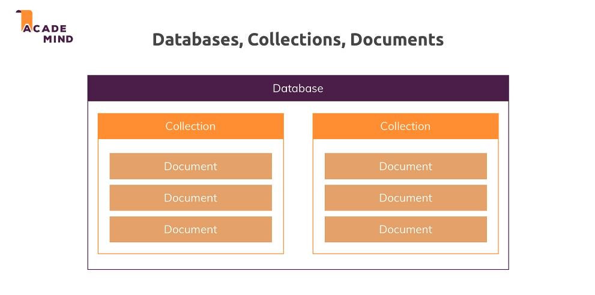

# Index

- [Schema](#Schema)
- [CRUD operations](#CRUD-operations)
- [General commands](#General-commands)
- [Delete commands](#Delete-commands)

## Schema




## CRUD operations

- Create
  - insertOne(data, options)
  - insertMany(data, options)
- Read
  - find(filter, options)
  - findOne(filter, options)
- Update
  - updateOnwe(filter, data, options)
  - updateMany(filter, data, options)
  - replaceOne(filter, data, options)
- Delete
  - deleteOne(data, options)
  - deleteMany(data, options)

## General commands

- Switch into dbName: Use [dbName]

## Delete commands

#### deleteOne

Delete the `first document` that matching with the filter into **_collectionName_** collection

```markdown
db.[collectionName].deleteOne({[key]:[value]})

// EXAMPLE
db.flightData.deleteOne({departureAirpot: "Bologna"})
```

#### deleteMany

Delete `all documents` that matching with the filter into **_collectionName_** collection

- Insert one document in collection: db.[collectionName].insertOne({ ... })
- Read all documents in collection: db.[collectionName].find()
- Read all documents in collection (formatted): db.[collectionName].find().pretty()

```

```
